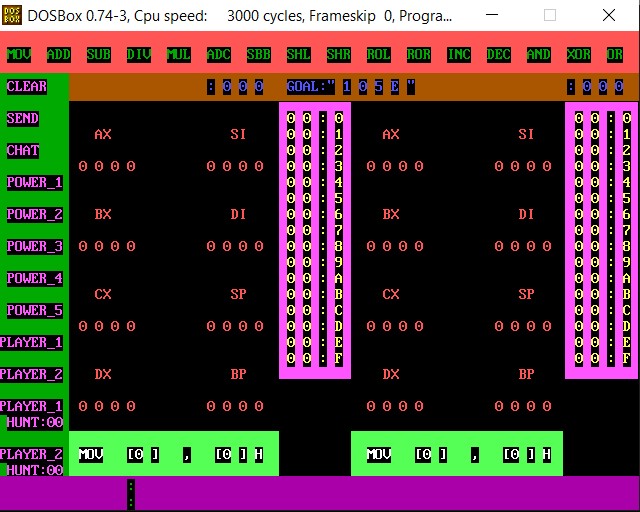

# 🕹️ **Microprocessor-Based Multiplayer Game & Chat System**

Welcome to the **Multiplayer Processor Simulation Game** – an immersive, assembly-language project that connects two PCs via serial communication for interactive gameplay and real-time chat functionality. This C++ and Assembly project brings a unique twist to microprocessor systems, blending digital logic, communication, and gaming.

## 🔑 **Core Features**

### 🎮 **Multiplayer Game Simulation**

- **Two-Player Processor Game**: Engage in a battle of wit and strategy. Players can execute commands on their opponent’s processor while using power-ups to prevent them from reaching victory.
- **Game Modes**: Choose from two exciting levels, each adding unique challenges and strategic opportunities.
- **Forbidden Characters**: Spice up the competition by banning specific alphanumeric characters in each game.

### 💬 **Chat Functionality**

- **Real-Time Chat**: Send and receive messages across a serial network, with each user having their own chat space.
- **Invite and Accept**: The system allows players to send and accept chat invitations directly from the game screen.
- **Intuitive Scrolling**: Navigate long chat sessions with a built-in scrolling system for uninterrupted conversations.

---

## 💻 **System Overview**

### **Serial Communication**
The project uses a serial communication system (Tx, Rx) to connect two PCs. This allows seamless interaction between the two users, whether they’re chatting or gaming. The **simple but powerful architecture** ensures real-time data transmission.

### **User-Friendly Interface**
- **Main Screen**: After login, both users are greeted with an organized main screen featuring easy navigation through game, chat, and other system functionalities.
- **Notification Bar**: Stay updated with game invites, chat notifications, and more, in a sleek and functional interface.

### **Processor Simulation**
- **Real-Time Execution**: Commands execute directly on the opponent’s virtual processor, and special power-ups can be used to add even more strategy to the game.
- **Truth Tables**: Automatically generated truth tables provide insights into each player’s commands and game outcomes.

---

## 🔧 **Project Structure**

This assembly-language project is organized into key functional modules, ensuring code clarity and maintainability:

### **Key Functions** (From Assembly Code)
- **[Main Function 1]**: Core logic for initializing game screen, setting up serial communication, and processing user inputs.
- **[Main Function 2]**: Handles game commands, execution logic, and validation checks for forbidden characters and errors.
- **[Main Function 3]**: Power-up management, ensuring players can use the special features tactically in the game.
*(More detailed breakdown available in the `.xlsx` file)*

---

## 📚 **Gameplay Walkthrough**

1. **User Login**: Start by entering your username and connecting to the game session via serial communication.
2. **Select Game Mode**: After login, the game screen offers several options. Players can choose between different game levels and enter forbidden characters to challenge their opponents.
3. **Command Execution**: Players take turns executing assembly-like commands on the opponent’s processor. Use strategic commands to control the game and try to achieve the target value first.
4. **Use Power-Ups**: Special in-game power-ups allow players to disrupt their opponents by modifying commands, changing forbidden characters, or even manipulating processor registers.
5. **Victory!**: The player who successfully inserts the value `105e` into their opponent’s register wins the game!

*(For a more detailed description of the project flow and functionalities, refer to the attached project PDF.)*

---

## 🚀 **How to Run the Project**

1. **Clone the Repository**: 
   ```bash
   git clone [<repo-link>](https://github.com/omarkhaled2001/Microprocessors-Systems-I-Project.git)
   ```
2. **Compile the Code**: Use an x86 assembler like MASM or TASM to compile the assembly code.
3. **Run the Executable**: Run the generated executable on two connected PCs with serial communication enabled.

*(For full setup instructions and requirements, refer to the project PDF.)*

---

## 💥 **Screenshots**




---

## 🛠️ **Contributions & Improvements**

Want to improve the gameplay or add more features? We welcome contributions! Feel free to submit a pull request or open an issue if you have any ideas or encounter any bugs.

---

## 👏 **Special Thanks**

This project was developed as part of the **CMP2010 Microprocessor Systems I** course at **Cairo University**. Special thanks to our professors and teaching assistants for their guidance and support.


